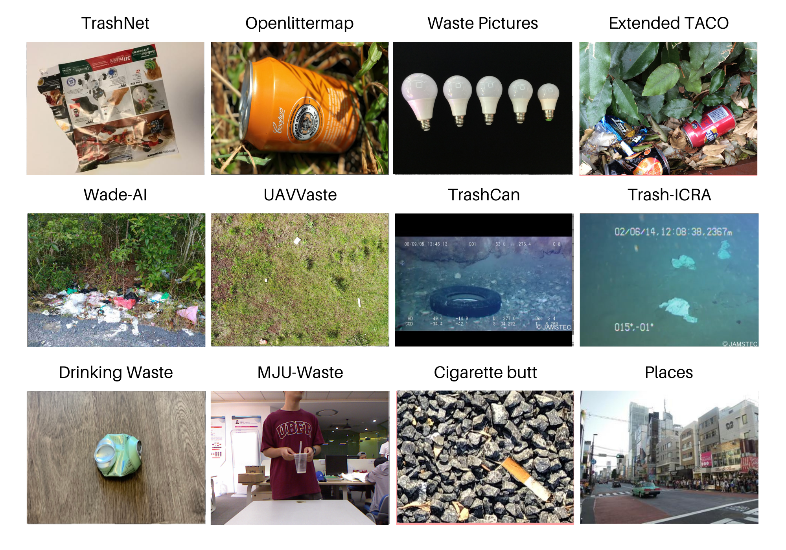
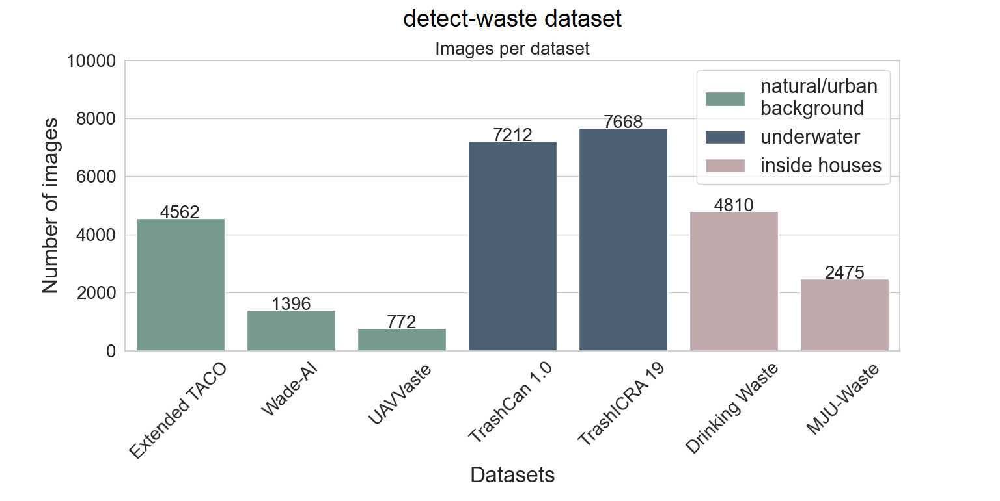
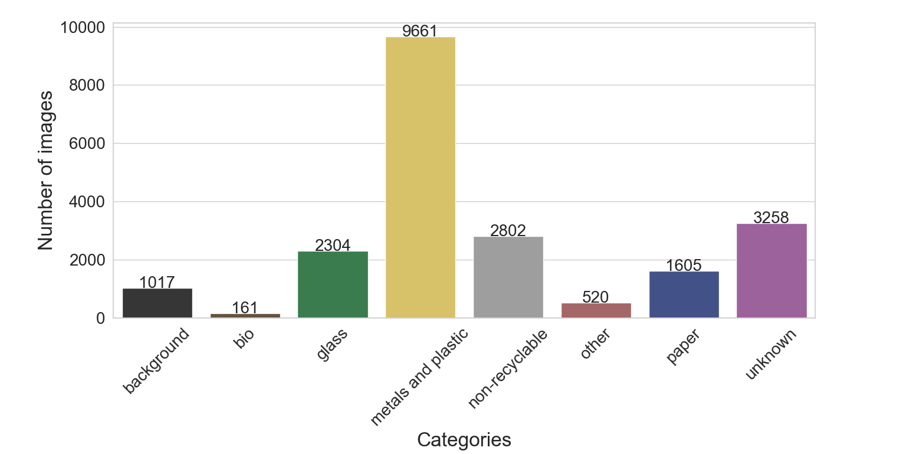

# Classify-Waste and Detect-Waste
For the past few years, considerable attempts have been made toward the development of various waste datasets. However, each has crucial limitations such as lack of background diversity, uneven distribution of classes, a small number of annotations, or specific environments such as aerial or underwater images. Considering those limitations, we propose new benchmark datasets detect-waste for litter detection and classify-waste for litter classification. It addresses the above-mentioned limitations not only by simply raising the number of data instances but additionally by evening the distribution of waste locations and, most importantly, waste types. 

 

## Detect-waste
The proposed detect-waste benchmark is a merged collection of Extended TACO (dataset created by us) and publicly available datasets with detection annotations: Wade-AI, UAVVaste, TrashCan, TrashICRA, Drinking-Waste, and MJU-Waste. We ensured that detect-waste contains over 28~000 images and over 40~000 objects with a unified bounding box annotation and a single label *litter*. The main advantage of the created detect-waste is its diversity provided by a combination of existing datasets. Images are from three main environmental categories: indoor, outdoor (urban and natural), and underwater. Moreover, images were taken in various lighting conditions, using different instruments and with wide range of objects sizes lowering the chances of bias in data. Collected data is represented by many waste types gathered from around the world, which ensures that model trained on this dataset will have satisfying generalization ability. 
 
 
## Classify-waste
The proposed classify-waste benchmark is a merged collection of publicly available datasets with eight classification labels.
The first six are based on the recycling rules in Gdańsk, Poland. The categories are unbalanced, some categories contain many types of waste data set like "other" while some contain only a few. It is suggested to sub-classify the "other" category in parts like construction and demolition, electronic waste which includes batteries etc. (E waste), and hazardous waste, like the waste from hospitals including medicines, syringes, and similar. In many countries, concept of "Waste To Energy" is evolving. In this regard, two separate classifications of combustible waste and non-combustible waste may be assigned. For example, wood and similar things may be classified as combustible and Construction waste and similar as non-combustible.

Categories with corresponding examples are as follows:

* bio: food waste such as fruit, vegetables, herbs, used paper towels and tissues,
* glass: glass objects such as glass bottles, jars, cosmetics packaging, 
* metals and plastic: scrap metal and non-ferrous metal, beverage cans, plastic beverage bottles, plastic shards, plastic food packaging, or plastic straws, 
* non-recyclable: residual rubbish such as disposable diapers, pieces of string, polystyrene packaging, polystyrene elements, blankets, clothing, or used paper cups,
* other: construction and demolition, large-size waste (e.g. tires), used electronics and household appliances, batteries, paint and varnish cans, or expired medicines, 
* paper: paper, cardboard packaging, receipts, newspapers, catalogues, and books, 
* unknown waste: highly decomposed and hard-to-recognize litter,
* and extra class *background* without any litter: a sidewalk, a forest path, a lawn.

 

# Datasets

In Detect Waste in Pomerania project we used 9 publicity available datasets, and additional data collected using [Google Images Download](https://github.com/hardikvasa/google-images-download).

For more details, about the data we used, check our [jupyter notebooks](https://github.com/wimlds-trojmiasto/detect-waste/tree/main/notebooks) with data exploratory analysis.

## Data download
* TACO dataset can be downloaded [here](http://tacodataset.org/). TACO bboxes will be avaiable for download soon.

    Clone Taco repository
        `git clone https://github.com/pedropro/TACO.git`

    Install requirements
        `pip3 install -r requirements.txt`

    Download annotated data
        `python3 download.py`

* [UAVVaste](https://github.com/UAVVaste/UAVVaste)

    Clone UAVVaste repository
        `git clone https://github.com/UAVVaste/UAVVaste.git`

    Install requirements
        `pip3 install -r requirements.txt`

    Download annotated data
        `python3 main.py`

* [TrashCan 1.0](https://conservancy.umn.edu/handle/11299/214865)

    Download directly from web
    `wget https://conservancy.umn.edu/bitstream/handle/11299/214865/dataset.zip?sequence=12&isAllowed=y`

* [TrashICRA](https://conservancy.umn.edu/handle/11299/214366)

    Download directly from web
    `wget https://conservancy.umn.edu/bitstream/handle/11299/214366/trash_ICRA19.zip?sequence=12&isAllowed=y`

* [MJU-Waste](https://github.com/realwecan/mju-waste/)

    Download directly from [google drive](https://drive.google.com/file/d/1o101UBJGeeMPpI-DSY6oh-tLk9AHXMny/view)

* [Drinking Waste Classification](https://www.kaggle.com/arkadiyhacks/drinking-waste-classification)

    In order to download you must first authenticate using a kaggle API token. Read about it [here](https://www.kaggle.com/docs/api#getting-started-installation-&-authentication)

    `kaggle datasets download -d arkadiyhacks/drinking-waste-classification`

* [Wade-ai](https://github.com/letsdoitworld/wade-ai/tree/master/Trash_Detection)

    Clone wade-ai repository
        `git clone https://github.com/letsdoitworld/wade-ai.git`

    For coco annotation check: [majsylw/wade-ai/tree/coco-annotation](https://github.com/majsylw/wade-ai/tree/coco-annotation/Trash_Detection/trash/dataset)

* [TrashNet](https://github.com/garythung/trashnet) - The dataset spans six classes: glass, paper, cardboard, plastic, metal, and trash.

    Clone trashnet repository
        `git clone https://github.com/garythung/trashnet`

* [waste_pictures](https://www.kaggle.com/wangziang/waste-pictures) - The dataset contains ~24k images grupped by 34 classes of waste for classification purposes.

    In order to download you must first authenticate using a kaggle API token. Read about it [here](https://www.kaggle.com/docs/api#getting-started-installation-&-authentication)

    `kaggle datasets download -d wangziang/waste-pictures`

For more datasets check: [waste-datasets-review](https://github.com/AgaMiko/waste-datasets-review)
